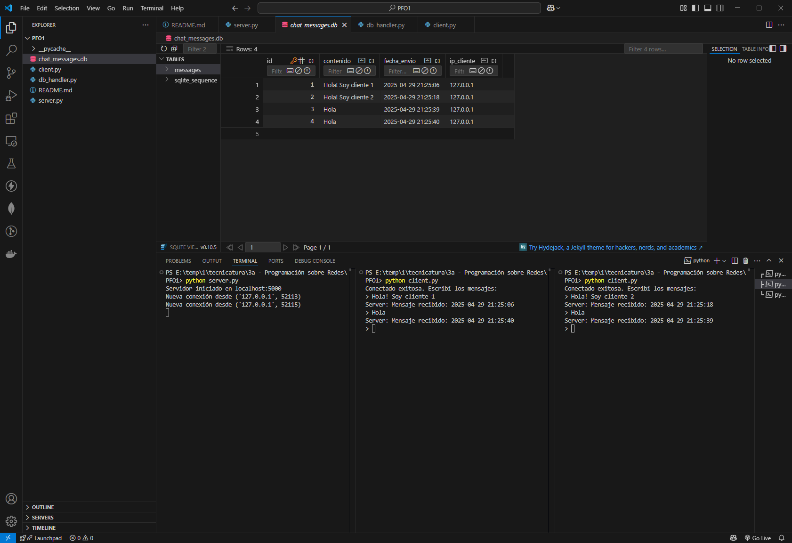
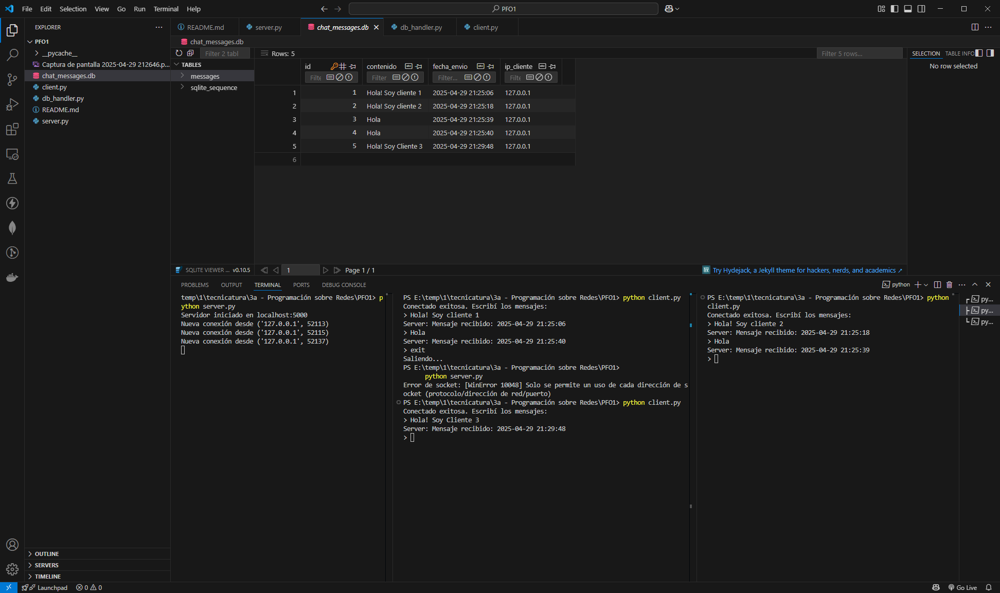
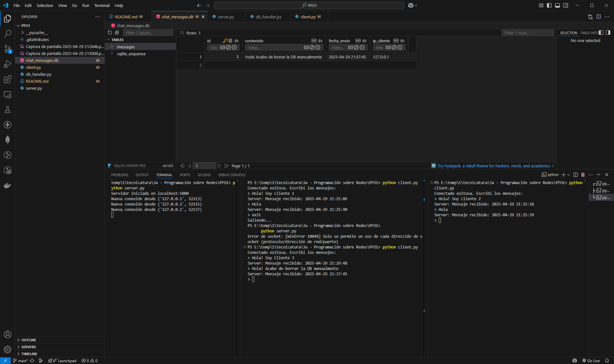

# Proyecto de Chat - Cliente-Servidor Básico con Sockets y SQLite

## Descripción del Proyecto

Este proyecto implementa una aplicación de chat básica cliente-servidor en Python.  
Utiliza **sockets TCP/IP** para la comunicación y **SQLite** para almacenar los mensajes en una base de datos local.

El servidor escucha conexiones de clientes, recibe mensajes, los guarda y responde confirmando la recepción.

## Estructura del Proyecto

```
PFO1/
├── server.py       # Lógica del servidor: socket, recepción de mensajes
├── client.py       # Lógica del cliente: conexión y envío de mensajes
├── db_handler.py   # Manejo de la base de datos: guardar mensajes
└── README.md       # Instrucciones y plan de pruebas
```

## Instrucciones para ejecutar el proyecto

### 1. Verificar instalación de Python

Debe estar instalado **Python 3** en el sistema.

Para verificarlo:

```bash
python --version
```

### 2. Iniciar el Servidor

- Abrir una terminal.
- Navegar a la carpeta del proyecto.
- Ejecutar el servidor:

```bash
python server.py
```

Se debe mostrar:

```
Servidor iniciado en localhost:5000
```

### 3. Iniciar el Cliente

- Abrir otra terminal.
- Navegar a la carpeta del proyecto.
- Ejecutar el cliente:

```bash
python client.py
```

Se debe mostrar:

```
Conectado exitosamente. Escribí los mensajes:
```

### 4. Enviar mensajes

- Escribir cualquier mensaje y presionar **Enter**.
- El servidor debe confirmar la recepción con un timestamp.

Ejemplo:

Cliente:

```
> Hola servidor
Server: Mensaje recibido: 2025-04-29 18:00:12
```

Servidor:

```
Nueva conexión desde ('127.0.0.1', 53402)
```

### 5. Cerrar sesión del cliente

- Escribir:

```
exit
```

Cliente:

```
Saliendo...
```

El cliente se desconecta correctamente.

## Base de Datos

- El servidor crea automáticamente una base de datos SQLite llamada `chat_messages.db`.
- Los mensajes se almacenan en la tabla `messages` con los siguientes campos:
  - `id`: identificador único (autoincremental)
  - `contenido`: contenido del mensaje
  - `fecha_envio`: fecha y hora de envío
  - `ip_cliente`: dirección IP del cliente

### Confirmar almacenamiento en base de datos

- Verificar que existe el archivo `chat_messages.db`.
- Abrir la base de datos (yo use la extensión **SQLite Viewer**).
- Confirmar que los mensajes estén registrados en la tabla `messages`.

## Manejo de errores

El sistema gestiona errores como:

- Puerto ocupado o en uso.
- Errores de conexión a la base de datos.
- Errores de comunicación por socket.

Los errores se muestran en la consola de ejecución.

## Finalizar cliente

- Escribir `exit` para cerrar el cliente de forma controlada.

Cliente:

```
Saliendo...
```

Servidor:

- El socket del cliente se cierra automáticamente.

## Capturas de Pantalla de uso

### Utilizando 2 clientes


### Tratando de iniciar el Server nuevamente estando ya inicializado


### Borrando la Base de datos Manualmente. El controlador lo detecta y la crea nuevamente sin tirar error



## Posibles mejoras futuras y funcionalidades para agregar

- **Cierre controlado del servidor**:
  - Agregar un comando (por ejemplo, `shutdown_server`) que permita finalizar el servidor desde un cliente autorizado.
  - Otra opción: cerrar el servidor si no hay actividad durante cierto tiempo (inactividad total).

- **Comando de listar historial**:
  - Permitir que el cliente solicite los últimos mensajes almacenados desde la base de datos.

- **Servidor multicliente más robusto**:
  - Limitar la cantidad máxima de clientes activos.
  - Mostrar en consola cuántos clientes están conectados.

- **Mensajes con nombres de usuario**:
  - Pedir un nombre al conectarse y registrar cada mensaje con ese identificador en la base de datos.

- **Registro de logs del servidor**:
  - Guardar todas las conexiones, errores y mensajes en un archivo `.log` para auditoría.